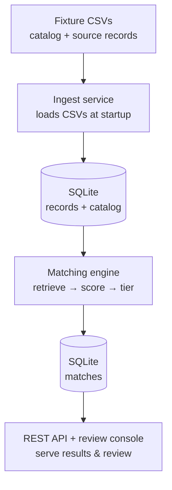
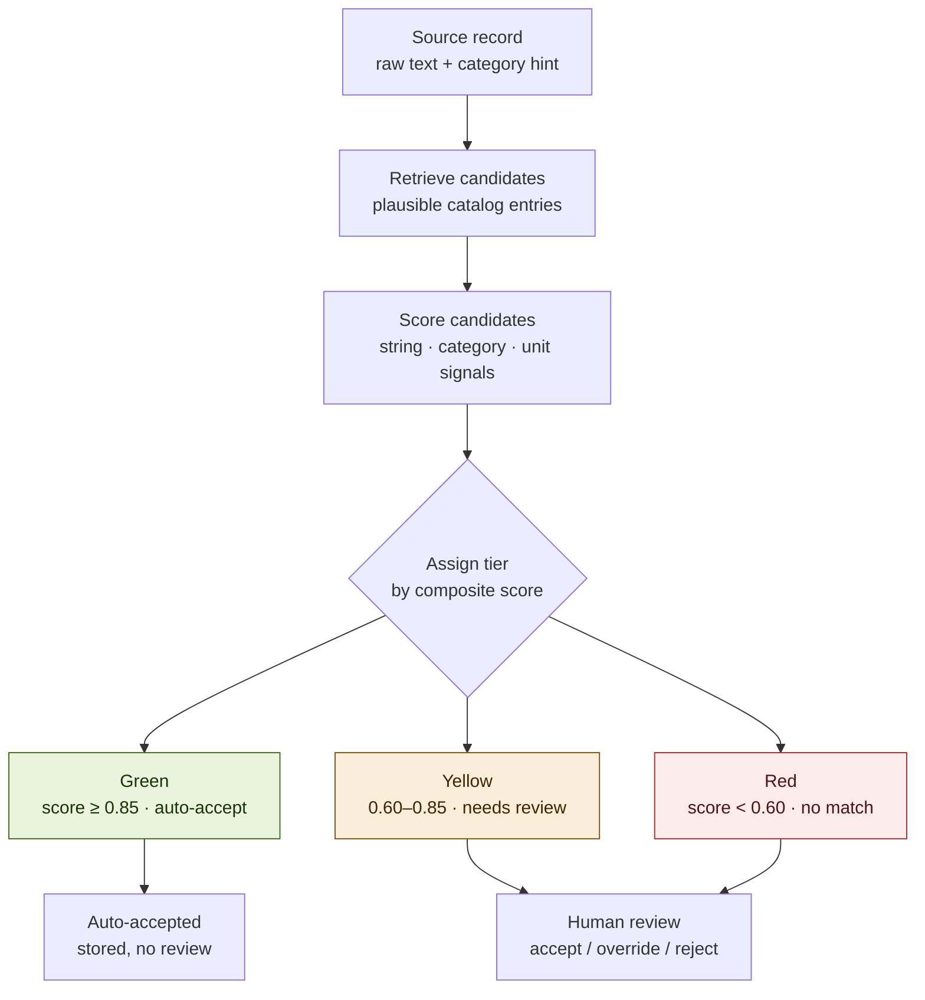
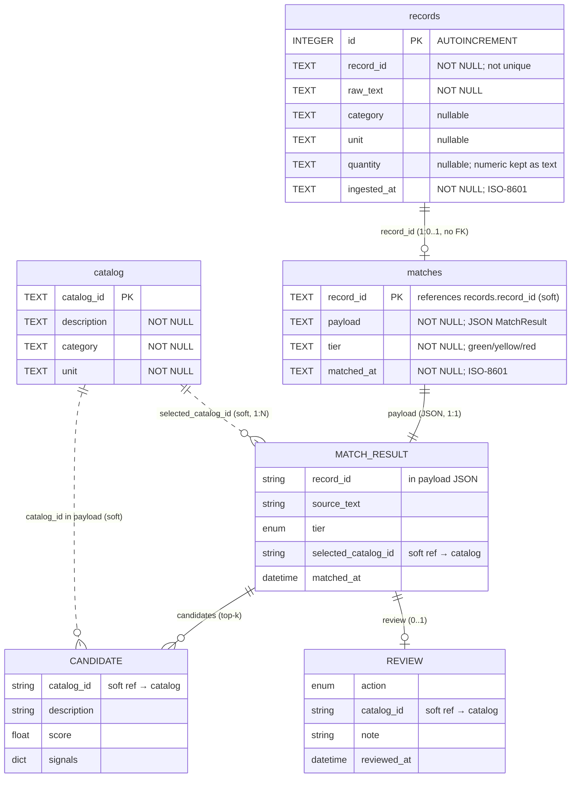

# Architecture Notes

SpecMatch is a system for matching records from a source dataset to a target dataset. SpecMatch ingests two CSVs at startup — 150 messy construction-material **source records** and 800 clean **catalog** entries — matches each record to catalog candidates, scores and tiers the matches (green / yellow / red), and serves them through a JSON API and a server-rendered review console.

### How the pieces connect

---

The codebase is layered, organised and is enforced by 'CONTRIBUTING.md'. **routers stay thin and live in** `routers/` **and delegate to** `services/` **where the business logic lives**, and `core/` **provides shared infrastructure**, and `models/schemas.py` **is the frozen contract every layer speaks**. Dependencies point one way i.e. **downwards**: `main` wires everything up

## 1. End‑to‑end data flow




## 2. Matching and tier assignment




## 3. Data model (ER diagram)

Solid lines (`--`) are physical SQLite tables; dotted lines (`..`) are *soft*
references — `catalog_id` is not a column and not an FK, it lives inside the
`matches.payload` JSON and is resolved in application code. `MATCH_RESULT` /
`CANDIDATE` / `REVIEW` are **not tables**: they are the Pydantic shapes
serialized *into* `matches.payload`, shown here to expose what the JSON holds.



**Relationships & integrity notes:**

- **`records` 1 ── 0..1 `matches`** on `record_id`: `matches.record_id` is the
  PK, so there is at most one match row per record. The whole `MatchResult` is
  stored as JSON in `payload`; the table is empty until the engine (Task 3)
  populates it.
- **`matches` → `catalog` is a *soft* reference held *inside* `payload`.** There
  is **no `catalog_id` column** on `matches` and no SQL join — `candidates[].catalog_id`
  and `selected_catalog_id` are read out of the JSON in application code. One
  catalog entry can be selected by **many** match results (hence `1:N`).
- **No foreign keys are enforced.** `get_conn()` sets `PRAGMA foreign_keys = ON`,
  but the DDL declares **no `FOREIGN KEY` constraints**, so nothing guarantees a
  `matches.record_id` — or an embedded `catalog_id` — actually exists.
- **`records.record_id` is not unique** — the PK is the autoincrement `id`, and
  `ingest_records()` does a plain `INSERT`, so restarts can create duplicate
  `record_id`s. That makes the `record_id` link genuinely soft.
- **Everything is `TEXT` except `records.id`.** Timestamps are ISO-8601 strings,
  `quantity` is stored as text though numeric in the CSV, and `tier` mirrors the
  `Tier` enum by convention only (no `CHECK` constraint).

---

## `app/main.py` — entry point & wiring hub

`main.py` is the **composition root** of the FastAPI application.  
It creates the app, registers routers, configures startup behavior, and connects all major components together.  
The lifespan function initializes logging and runs ingestion before the server accepts requests.

## `app/config.py` — configuration gateway

`config.py` is the **single typed access point** for `config/settings.yaml`.  
It loads scoring weights, thresholds, and matching settings into immutable dataclass objects.  
All tunable values come from configuration instead of being hardcoded in Python.

## `app/models/` — contract & schema layer

`models/` contains the shared data contracts used across the entire application.  
It defines Pydantic request/response schemas and enums like `Tier` and `ReviewAction`.  
Every layer depends on this package because it provides the common vocabulary of the system.

## `app/core/` — shared infrastructure layer

`core/` contains foundational utilities that support the rest of the application.  
It handles database connections, structured logging, and common application errors.  
This layer has no business logic and provides reusable building blocks for services and routers.

## `app/core/db.py` — database gateway

`db.py` manages all SQLite interactions for the application.  
It provides database connections, schema initialization, and helper functions for locating database files.  
Other layers use it instead of directly handling SQLite configuration.

## `app/core/logging.py` — structured logging system

`logging.py` defines the application's logging format and utilities.  
It provides JSON logging, logger configuration, and the shared `log_event()` helper.  
All application events use this centralized logging mechanism.

## `app/core/errors.py` — application exceptions

`errors.py` contains custom exception types used across the project.  
Currently it defines `DependencyError` for failures involving external resources like files or databases.  
Keeping errors centralized makes failure handling consistent.

## `app/services/` — business logic layer

`services/` contains the application's core functionality and processing workflows.  
Routers call services instead of implementing business rules themselves.  
This keeps HTTP handling separate from application logic.

## `app/services/ingest.py` — data ingestion service

`ingest.py` loads CSV data into the SQLite database during application startup.  
It handles parsing files, inserting records, logging events, and converting failures into application errors.  
It can also run independently as a standalone command.

## `app/services/matching/` — matching subsystem

`matching/` contains the main candidate matching engine and related components.  
It separates retrieval, scoring, ranking, and tier assignment into replaceable pieces.  
This design allows matching strategies to evolve without changing API code.

## `app/services/matching/interfaces.py` — matching contracts

`interfaces.py` defines abstract interfaces for retrievers, scorers, and matching engines.  
It establishes the rules that implementations must follow without defining the actual logic.  
This enables swapping algorithms while keeping the rest of the application unchanged.

## `app/services/matching/engine.py` — matching orchestrator

`engine.py` coordinates the complete matching workflow.  
It retrieves candidates, applies scoring rules, assigns tiers, creates results, and stores matches.  
It connects configuration, database access, models, and matching strategies together.

## `app/services/matching/tiering.py` — score classification

`tiering.py` converts numerical match scores into business categories.  
It uses configured thresholds to assign tiers such as accept, review, or reject.  
The logic stays separate so tier rules can change independently.

## `app/routers/` — HTTP API layer

`routers/` contains FastAPI endpoints exposed to clients.  
Each router handles HTTP concerns like requests, responses, and validation.  
Business logic stays inside services, keeping routes thin and maintainable.

## `app/routers/health.py` — health endpoint

`health.py` provides the application health check endpoint.  
It verifies database availability and returns system statistics through a response schema.  
Used by monitoring tools to confirm the service is running.

## `app/routers/records.py` — records API

`records.py` provides endpoints for retrieving stored records.  
It handles pagination while delegating data access to the database layer.  
Responses are returned using shared Pydantic models.

## `app/routers/matches.py` — matching API

`matches.py` declares the endpoints for retrieving matches and submitting reviews; both are currently stubbed (they return HTTP 501) pending task.  
Once built, it will connect HTTP requests to the matching service workflow.  
The router only manages API communication and validation.

## `app/routers/console.py` — web console router

`console.py` serves the browser-based review console using Jinja2 templates.  
It is the only router responsible for rendering HTML pages.  
It connects backend data with the server-rendered UI.

## `app/templates/` — HTML presentation layer

`templates/` contains the Jinja2 HTML files used by the web console.  
Templates define the user interface while routers provide the required data.  
The frontend remains separate from backend business logic.

## `app/templates/base.html` — shared page layout

`base.html` defines the common structure for all console pages.  
It contains navigation, styling, and reusable HTML elements.  
Other templates extend this file instead of duplicating layout code.

## `app/templates/records.html` — records page

`records.html` displays the record table in the console.  
It extends the base layout and provides filtering functionality.  
Data is supplied by the console router.

## `app/templates/review.html` — review interface

`review.html` contains the interface for reviewing match results.  
Currently it acts as a placeholder for the future review workflow.  
It will later support human feedback and match decisions.

---

## Q1 — Trace one record from `source_records.csv` to the review console

I'll follow the first row of the fixture:

```
record_id, raw_text,             category,   unit, quantity
SRC-0001,  BATT  INSUL MW R-22,  Insulation, m2,   4526.8
```

`raw_text` is abbreviated shop shorthand (`BATT INSUL MW R-22` ≈ "batt
insulation, mineral wool, R-22") — exactly the kind of string the engine must
reconcile against clean catalog prose. Its journey, module by module
(⚙️ = already built, 🚧 = a stub I will build):

1. `data/source_records.csv` — the raw row on disk (one of 150). The catalog
  it will be scored against is the 800-row `data/catalog.csv`. (Note the raw
   text carries a doubled space, `BATT··INSUL` — exactly the whitespace noise the
   engine has to normalize away.)
2. ⚙️ `app/main.py` **→** `lifespan()` — at boot, *before any request is served*,
  the lifespan hook runs `configure_logging()` then `run_ingest()`. This startup
   step is the only reason the row ever reaches the database.
3. ⚙️ `app/services/ingest.py` **→** `run_ingest()` — calls `init_schema()`, then
   `ingest_catalog()` (loads the 800 catalog rows via `INSERT OR REPLACE`), then
   `ingest_records()` → `_read_csv()` parses the CSV into dict rows and `INSERT`s
   each into the `records` table, stamping an `ingested_at` UTC timestamp.
4. ⚙️ `app/core/db.py` — `get_conn()` hands ingest a SQLite connection and
  `init_schema()` creates the tables; the row now physically lives in the
   `records` table (`record_id, raw_text, category, unit, quantity,  ingested_at`). **This is the furthest a record travels today** — everything
   below is the path I'm building in Tasks 3 & 5.
  > **Hand-off point.** Ingest *writes* the record here; the engine will later
  > *read* it back out. The database is the seam between the two halves of the
  > flow — there is no in-memory pipeline connecting them.
5. 🚧 `app/services/matching/engine.py` **→** `match_all()` **/** `match_record()` —
  the orchestrator that turns the stored record into a scored, tiered result:
  - **reads** the record and the full `catalog` back out of `core/db.py`;
  - 🚧 `interfaces.py` — `CandidateRetriever.retrieve(record, catalog, limit)`
  narrows 800 catalog rows to a plausible shortlist (e.g. the Insulation
  entries), then `CandidateScorer.score(record, entry)` turns each into a
  `Candidate` with a composite `score` and a per-signal `signals` breakdown
  (`string_similarity`, `category_agreement`, `unit_compatibility`);
  - ⚙️ `app/config.py` **←** `config/settings.yaml` — `get_settings()` supplies
  the signal **weights** and `top_k` the scorer combines and keeps;
  - ⚙️ `app/services/matching/tiering.py` — `assign_tier()` maps the top
  candidate's score to a `Tier` (green/yellow/red) using `Settings.tiers`;
  - ⚙️ `app/models/schemas.py` — the frozen `Candidate` / `MatchResult`
  shapes the output must conform to;
  - **writes** the resulting `MatchResult` (JSON) into the `matches` table
  (keyed by `record_id`, with a denormalized `tier`) via `core/db.py`.
6. 🚧 `app/routers/console.py` **→** `GET /review` **(**`review_panel`**)** — a thin
  handler that **reads** the persisted `MatchResult`s from the `matches` table,
   groups the yellow/red queues, and passes them to the template.
7. 🚧 `app/templates/review.html` (extends `base.html`) — renders the record
  in its queue with candidate scores, the per-signal breakdown, and
   accept / override / reject controls — **the point where the record appears in
   the review console**. Those actions POST to
   `POST /matches/{record_id}/review` (Task 4), which persists a `Review` back
   onto the same `MatchResult`.

**One-line pipeline:**
`source_records.csv → ingest.py → [records] → engine.py (+ interfaces, config, tiering, schemas) → [matches] → console.py /review → review.html`

Cross-cutting the whole path, `app/core/logging.py` emits a structured event
at each stage (`ingest_completed`, `app_started`, …) and `app/core/errors.py`
standardizes any filesystem/DB failure as a `DependencyError` (see Q3).

> Today, before Tasks 3 & 5, the record stops at step 4 and is only visible in
> the **record table** at `/` (`console.py:record_table` → `records.html`), which
> reads `records` directly and never touches the engine or the `matches` table.
> Steps 5–7 are what this trace becomes once the engine and review panel exist.

---


## Q2 — Tier thresholds: where they live, and moving the review/accept boundary

**Where they're defined — in data, never in Python** (`config/settings.yaml`):

```yaml
tiers:
  accept_min: 0.85   # score ≥ this → green  (auto-accept)
  review_min: 0.60   # score ≥ this → yellow (human review); below → red
```

**How they reach the code (the connection chain).** Three read-only hops:

1. `app/config.py` **→** `config_path()` decides *which* file to read — the repo's
  `config/settings.yaml` by default, or whatever the `SPECMATCH_CONFIG`
   env var overrides it to.
2. `get_settings()` (`@lru_cache(maxsize=1)`) reads that YAML **once** and
  parses it into frozen dataclasses; `Settings.tiers` becomes a
   `TierThresholds(accept_min, review_min)`.
3. `app/services/matching/tiering.py` **→** `assign_tier(score, thresholds)`
  consumes that `TierThresholds` and maps a composite score to a `Tier`:
   `score ≥ accept_min → green`, `review_min ≤ score < accept_min → yellow`,
   else `red`. The engine (Task 3) calls `assign_tier` with `Settings.tiers`, so
   the YAML number flows all the way to the tier stamped on each `MatchResult`.

**Moving the review/accept boundary without touching Python.** There are two
boundaries; the **review/accept** one is `accept_min` — the cutoff between
*yellow* (needs human review) and *green* (auto-accept). (`review_min` is the
other one, reject↔review.) To move it, edit that single value and restart:

```yaml
tiers:
  accept_min: 0.80   # was 0.85 → auto-accepts more, shrinks the review queue
  review_min: 0.60
```

- **Lower** `accept_min` (0.85 → 0.80): more matches clear as green, fewer reach
the human review queue.
- **Raise** it (0.85 → 0.90): more borderline matches are held for review instead
of auto-accepted (more conservative).

*Worked example:* a candidate scoring **0.83** is *yellow* under the default 0.85;
drop `accept_min` to 0.80 and that same match becomes *green* — no code change,
just a config edit and a restart. This is possible only because `tiering.py`
reads the threshold through `get_settings()` instead of hardcoding it — that
indirection is the whole point of the config layer. (Alternatively, leave
`settings.yaml` alone and point `SPECMATCH_CONFIG` at an experiment config.)

**Two caveats I noted/verified while reading:**

- `get_settings()` is `@lru_cache`d and read **once per process**, so editing
`settings.yaml` on a running server has no effect until **restart** — there's
no hot reload.
- **Boundary bug:** `assign_tier` uses a **strict** `>` for accept
(`if score > thresholds.accept_min`) although the YAML comment, `config.py`,
and its own docstring all say the bound is *inclusive* (`≥`). A score of exactly
`0.85` therefore returns **yellow, not green**, while the `review_min` side uses
`≥` — so the two boundaries are inconsistent. `test_tiering.py` only checks
0.95 / 0.70 / 0.30, never the exact boundary, so it passes regardless. I'll
resolve this deliberately (committing a boundary test first) — see `PLAN.md`.

---


## Q3 — The dependency-failure convention (`CONTRIBUTING.md`)

**The rule, verbatim** (`CONTRIBUTING.md`, "Error handling"):

> Every call to an external dependency (filesystem, network, subprocess,
> database file) must catch the dependency's specific exception type at the
> call site, log a structured `dependency_failure` event that includes the
> dependency name and enough context to reproduce, and re-raise as
> `app.core.errors.DependencyError` using `raise ... from exc`.

It adds: *"Never swallow a dependency failure, and never let a raw* `OSError` *(or
similar) escape a service function."*

**Unpacked, it mandates four things at every external call site:**

1. **Catch the *specific* exception** (e.g. `OSError`) — never a bare `except:`.
2. **Log a structured** `dependency_failure` **event** naming the dependency and
  enough context to reproduce (path, args, …), through `core/logging.log_event`
   — never `print()` or an interpolated string.
3. **Re-raise as** `app.core.errors.DependencyError` (the single custom type in
  `core/errors.py`) so callers see one uniform failure type.
4. **Chain the cause** with `raise … from exc` to preserve the traceback.

**Where the existing code follows it —** `app/services/ingest.py`**,** `_read_csv()`
(lines 25–38). Each clause of the convention maps to one line:

```python
def _read_csv(path: Path) -> list[dict[str, str]]:
    try:
        with path.open("r", encoding="utf-8", newline="") as fh:
            return list(csv.DictReader(fh))
    except OSError as exc:                     # 1. specific exception, at the call site
        log_event(                             # 2. structured dependency_failure event…
            logger, logging.ERROR, "dependency_failure",
            dependency="filesystem", path=str(path), error=str(exc),  # …named + reproducible
        )
        raise DependencyError(                 # 3. re-raise as DependencyError
            f"could not read fixture file: {path}"
        ) from exc                             # 4. chained cause
```

`app/config.py`'s `get_settings()` (the same `try/except`, lines 53–65) applies the identical pattern
when reading `settings.yaml`. Together they show how the convention *connects
three modules* — the call site (`ingest` / `config`, and soon `engine`) +
`core/logging.log_event` + `core/errors.DependencyError` — a cross-cutting
pattern rather than bespoke per-module handling. These two functions are my
templates for every SQLite call I add in Tasks 3–4.

**One gap this exposes (relevant to my Task 4 work):** nothing currently
*catches* `DependencyError` — there is no FastAPI exception handler registered.
So one raised **at startup** (ingest) aborts boot, and one raised **inside a
request handler** surfaces as an unhandled **HTTP 500**. When my match endpoints
touch the DB they own that error surface, so I'll translate `DependencyError`
into a clean response instead of leaking a 500.