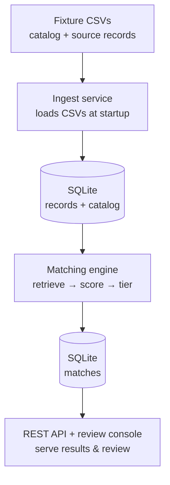
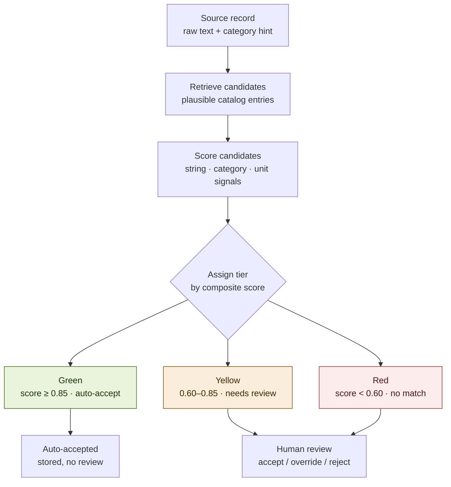
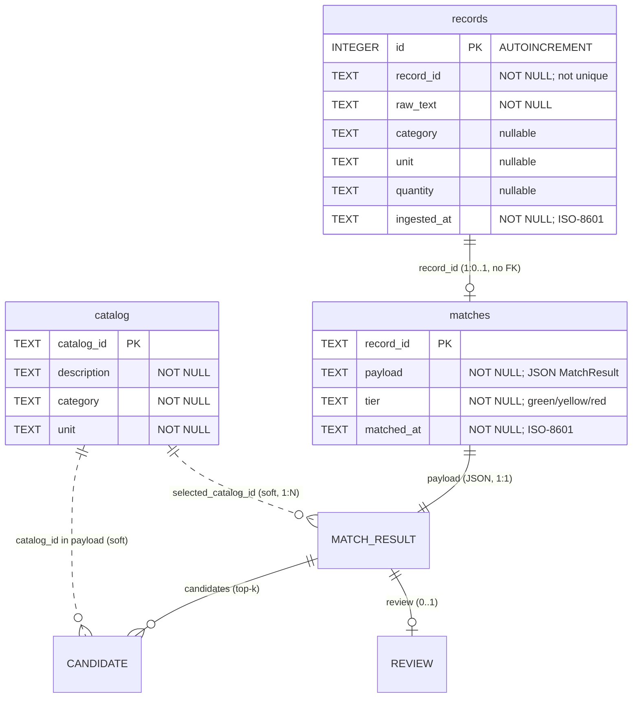

# SpecMatch

Material matching service and review console. A service that matches messy
construction-material records to a canonical catalog, assigns confidence
tiers, and exposes the results through an API and a server-rendered review
console.

`backend/app/models/schemas.py` is **frozen** — CI re-hashes it against
`.github/schema.sha256`, so any change fails the build. The matching-engine
design is documented below; see `APPROACH.md` for the full design narrative
and `PLAN.md` for the build order.

## System overview

SpecMatch ingests two fixture CSVs at startup — 150 messy construction-material
**source records** and 800 clean **catalog** entries — matches each record to
catalog candidates, scores and tiers the matches (green / yellow / red), and
serves them through a JSON API and a server-rendered review console.

Routers stay thin (`routers/`) and delegate to `services/` where the business
logic lives; `core/` provides shared infrastructure; `models/schemas.py` is the
frozen contract every layer speaks.

### End-to-end data flow



### Matching and tier assignment



### Data model

Solid lines are physical SQLite tables; dotted lines are *soft* references —
`catalog_id` lives inside the `matches.payload` JSON, not as a column.



See `ARCHITECTURE_NOTES.md` for the full module-by-module walkthrough.

## Quick start (Docker)

```bash
cp .env.example .env
docker compose up --build
```

API and console: http://localhost:8000 (console at `/`, API docs at `/docs`).

## Tests

```bash
cd backend
pytest
```

## API reference

All endpoints return JSON except the review console (`/` and `/review`), which
render HTML. Interactive docs are at http://localhost:8000/docs.

### `GET /health`

Returns service status and match counts by tier.

**Response** (`HealthResponse`):

```json
{
  "status": "ok",
  "records": 150,
  "matched": 150,
  "tiers": { "green": 114, "yellow": 25, "red": 11 }
}
```

### `GET /records`

Lists ingested source records (pre-existing endpoint; unchanged).

| Query param | Default | Notes |
|---|---|---|
| `limit` | `50` | `1`–`500` |
| `offset` | `0` | Page offset |

**Response** (`RecordsResponse`): `{ "total": <int>, "items": [ RecordOut ] }`

### `GET /matches`

Returns persisted match results, optionally filtered by tier. Ordered by
`record_id` (ingestion order). `total` is the count under the same filter,
not the page length.

| Query param | Default | Notes |
|---|---|---|
| `tier` | — | `green`, `yellow`, or `red`; omit for all tiers |
| `limit` | `50` | `1`–`500` |
| `offset` | `0` | Page offset |

**Response** (`MatchesResponse`): `{ "total": <int>, "items": [ MatchResult ] }`

Each `MatchResult` carries `record_id`, `source_text`, `tier`, `candidates`
(top-k with `catalog_id`, `description`, `score`, `signals`), optional
`selected_catalog_id`, optional `review`, and `matched_at`.

### `POST /matches/{record_id}/review`

Records an auditable human review decision. Returns the updated `MatchResult`
with a persisted `review` block (`action`, `catalog_id`, `note`, `reviewed_at`).

**Path:** `record_id` — e.g. `SRC-0002`

**Body** (`ReviewRequest`):

| `action` | Required fields | Effect |
|---|---|---|
| `accept` | — | Selects the top candidate |
| `override` | `catalog_id` (must be one of the record's candidates) | Selects that candidate; `note` optional |
| `reject` | — | Clears `selected_catalog_id`; `note` optional |

**Response:** updated `MatchResult` with `review` populated.

| Status | When |
|---|---|
| `200` | Decision persisted; body is the updated `MatchResult` |
| `400` | Invalid review (e.g. override without `catalog_id`, or `catalog_id` not in the record's candidates) |
| `404` | Unknown `record_id` |
| `422` | Malformed body (e.g. unknown `action`) |

### Review console

| URL | Purpose |
|---|---|
| `GET /` | Record table with category filter |
| `GET /review?tier=yellow` | Yellow/red review queues with per-signal breakdown |
| `POST /review` | Accept / override / reject (redirects back to queue) |

## Matching engine — retrieval & scoring design

SpecMatch maps messy source records (`CONC RM 30MPa w/ 25% FA`) to clean catalog
prose (`Ready-mix concrete, 30 MPa, 25% fly ash`). The two obvious approaches both
fail here:

- **A raw character-level ratio** fails because the two vocabularies barely overlap —
  `CONC RM` shares almost no characters with `Ready-mix concrete`.
- **A pure-LLM matcher** (150 records × ~800 catalog entries) is slow, costly, and
  non-deterministic: it can hallucinate a match and it tiers differently run to run,
  which a review console can't build on.

So the engine is a **hybrid**: normalization + stdlib token-set similarity + structured
category/unit/attribute signals. It uses **no third-party or ML dependency** — pure
stdlib (`difflib`, `re`), which keeps the clean-clone Docker/CI build unbreakable and
makes results **deterministic for a given `settings.yaml`**. Everything sits behind the
ABCs in `services/matching/interfaces.py`, so retrieval and scoring stay swappable.

### 1. Normalization (`normalize.py`) — highest leverage

Most of the accuracy is won here, before anything is compared. `normalize_text()` runs a
fixed pipeline: expand shorthand (`W/` → `with`), space glued units (`30MPa` → `30 mpa`),
normalize grades, collapse whitespace, lowercase, then expand a curated
construction-abbreviation vocabulary (`CONC RM` → `ready-mix concrete`; multi-token
entries applied longest-first). The abbreviation maps are module-level constants,
deliberately **not** in `settings.yaml` — they are domain knowledge, not tunable
parameters.

### 2. Retrieval (`retrieval.py`)

`LexicalRetriever` filters to same-category catalog entries when the record carries a
category, and falls back to the full catalog otherwise. At fixture scale (~800 entries)
brute-force scoring is trivially fast, so retrieval stays simple and the interface exists
mainly for swappability.

### 3. Scoring (`scoring.py`) — four signals, weighted from config

Each candidate gets a composite confidence score in `[0, 1]`: a weighted average of four
signals whose weights come **only** from `config/settings.yaml` (never hardcoded).

| Signal | Default weight | What it measures |
|---|---|---|
| `string_similarity`  | 0.45 | Token-set ratio (`difflib.SequenceMatcher`, max-of-three) over normalized text — robust to word reordering and extra tokens |
| `attribute_match`    | 0.25 | Jaccard overlap of structured specs (MPa, R-value, AWG, HSS/W-beam/rebar dimensions, %, grade) pulled by conservative regexes |
| `category_agreement` | 0.20 | 1.0 if categories match, else 0.0 |
| `unit_compatibility` | 0.10 | 1.0 if units match, else 0.0 |

**Neutral signals.** When a record has no category/unit, or no specs are extractable, that
signal returns `None` and is dropped from *both* the numerator and denominator of the
weighted average — missing data neither rewards nor punishes a candidate. The attribute
signal is what keeps a `W460x60` beam from scoring high against `W150x22` just because the
surrounding prose matches.

**Attribute extractors.** `attribute_match` runs a suite of ~16 conservative regexes over
the *normalized* (lowercased) text, then Jaccard-compares the two spec sets. Each pattern is
deliberately narrow — a missed spec scores neutral, never a false match:

| Spec | Example → extracted token |
|---|---|
| Concrete strength (MPa) | `30 MPa` / `30MPa` → `30mpa` |
| Insulation R-value | `R-22` → `r-22` |
| Wire gauge (AWG) | `#4/0 AWG` → `#4/0awg` |
| HSS dimensions | `6x6x1/4` → `6x6x1/4` |
| W-beam / channel | `W360X57` → `w360x57`, `C310X31` → `c310x31` |
| Rebar size | `15M` → `15m` |
| Grade (alphanumeric) | `Grade 400W` / `GR B` → `grade400w` / `gradeb` |
| Lumber grade | `No.1/Btr` / `No. 2` → `no1/btr` / `no2` |
| Facing | `unfaced` / `faced` |
| Percentage / additive | `25%` → `25%`, `fly ash` → `flyash`, `slag` |
| Dimensions / thickness | `50 mm` → `50mm`, `38x140` |
| Type / schedule / air | `Type X` → `typex`, `Schedule 40` → `schedule40`, `air entrained` |

### 4. Tiering (`tiering.py`)

The top candidate's score maps to a tier using **inclusive lower bounds** from
`settings.yaml`: `score >= accept_min (0.85)` → 🟢 **green** (auto-selects the catalog id),
`>= review_min (0.60)` → 🟡 **yellow** (human review), otherwise 🔴 **red**.

### 5. Persistence

The top `top_k` (5) candidates per record are stored as a `MatchResult` (JSON in the
`matches` table). Each candidate carries its catalog id + description (*what* matched),
composite `score`, and per-signal `signals` breakdown — enough for the console to explain
*why* a record landed in its tier.

### Hardening — what the fixtures exposed

The attribute extractors are the fragile part, and four fixture pairs drove the current
regexes. Each is a case where the composite score was *too high* until the spec was
actually compared:

- **Letter grades, on normalized text** (`STL HSS 10x6x1/2 GR B` vs a `Grade C` entry).
  `_GRADE_RE` only caught numeric grades and ran on the *raw* text, so `GR B` was invisible
  and the identical `10x6x1/2` dimensions scored a false green. Fix: capture alphanumeric
  grades (`\bgrade\s+([a-z0-9]+)\b`) and extract from the **normalized** text, so `GR B` →
  `grade b` is compared and the `B`-vs-`C` mismatch drops it to yellow.
- **Lumber grades** (`LBR 38x184mm SPF No.1/Btr` vs `SPF No.2`). Dimensions matched but the
  grade wasn't extracted, so the mismatch was invisible. Fix: `_LUMBER_GRADE_RE`
  (`\bno\.?\s*(\d+(?:/btr)?)\b`) surfaces `no1/btr` vs `no2`.
- **Insulation facing / subset inflation** (`BATT INSUL MW R-40 UNFACED` scored a false
  `1.000` against the generic `…R-40` entry, which is a perfect string *subset*). Fix:
  `_FACING_RE` extracts `unfaced`/`faced`, breaking the tie toward the correct entry.
- **Case-sensitive dimension regexes** (`STL BM W460X60` vs `W150x22`). The beam/channel/rebar
  patterns assumed uppercase but run *after* lowercasing, so they matched nothing, the
  attribute signal went neutral, and string similarity alone let a wrong beam through. Fix:
  `re.IGNORECASE` on `_WBEAM_RE` / `_CHANNEL_RE` / `_REBAR_SIZE_RE`.

The throughline: **a missed spec must score neutral, and every attribute regex runs on the
already-lowercased normalized text.** See `APPROACH.md` §5 for the full write-ups.

### Tier distribution (full fixture, default config)

Reproduce:

```bash
cd backend && python scripts/show_matches.py
```

| Tier | Count | Share |
|---|---|---|
| 🟢 green (auto-accept) | 114 | 76% |
| 🟡 yellow (needs review) | 25 | 17% |
| 🔴 red (no acceptable match) | 11 | 7% |
| **Total** | **150** | |

The spread confirms the tiers are meaningful — the engine neither greens nor yellows
everything:

- `CONC RM 30MPa w/ 25% FA` → 🟢 **0.961** → `CAT-0015 Ready-mix concrete, 30 MPa, 25% fly ash`
- `MISC MTL ALLOW` → 🔴 **0.346** (no catalog entry is a genuine match)

Results are deterministic for a given `settings.yaml`; retune the weights or thresholds
there and re-run the script to reproduce a new distribution.

### Design trade-off (honest note)

Because retrieval hard-filters to the record's category, every scored candidate for a
categorized record has `category_agreement = 1.0` — the signal lifts the absolute score
but does not discriminate between those candidates, and a record whose true match sits in
a different category would be filtered out. This trades a little recall for precision and
speed, which is acceptable when source categories are trustworthy; records without a
category fall back to full-catalog scoring, where the signal goes neutral.

## Issue fixes

Each issue was reproduced with a failing test committed before the fix.

### Issue #1 — Duplicate records after re-ingest

**Symptom:** Running ingest a second time doubled the record count (150 → 300).

**Cause:** `ingest_records()` used a plain `INSERT` on every row. The `records`
table has no unique constraint on `record_id` (only the autoincrement `id` is
the PK), so re-ingest silently appended duplicates.

**Fix:** Changed to `INSERT … SELECT … WHERE NOT EXISTS (SELECT 1 FROM records
WHERE record_id = :record_id)` — idempotent re-ingest without schema changes.
Catalog and matches already used `INSERT OR REPLACE`; records deliberately
keeps the asymmetry because `record_id` is not unique by design.

### Issue #2 — Wrong tier at a threshold boundary

**Symptom:** A match scoring exactly `0.85` landed in yellow instead of green.

**Cause:** `assign_tier()` used a strict `>` for the accept boundary
(`score > accept_min`) while `settings.yaml`, `config.py`, and the function's
own docstring all describe an *inclusive* lower bound (`score >= accept_min`).
The review boundary already used `>=`, so the two sides were inconsistent.

**Fix:** Changed `>` to `>=` in `tiering.py`. A score of exactly `0.85` is now
green; exactly `0.60` remains yellow.

### Issue #3 — Empty list after "All categories" filter

**Symptom:** Selecting "All categories" in the record table showed "No records."

**Cause:** The category `<select>` submits the literal string `"All"` for the
no-filter option, but `record_table()` passed that string straight into
`WHERE category = ?` — no row has `category = 'All'`, so the query returned
nothing.

**Fix:** Map the sentinel before querying: `if category == "All": category = None`,
mirroring the pattern the assessment calls out for any new filter.

## Deviations from `PLAN.md`

| Planned | Actual | Why |
|---|---|---|
| Three scoring signals in starter config | Four signals — added `attribute_match` weight to `settings.yaml` | Fixture pairs differed only on extracted specs (grade, facing, beam size); string similarity alone over-trusted prose |
| Optional ML/embeddings stretch | Not built | Lexical core needed more hardening (regex edge cases) than the optional stretch justified |
| Neutral signal for missing attributes | Missing catalog spec now penalises the match | A record matching on everything *except* grade should be yellow, not auto-green — catalog entries often differ only by grade |
| Task 5 polish trimmable if over budget | Console built to full spec | Engine finished on schedule; no polish was sacrificed |
| Docs finalized at submission | Added `APPROACH.md` | Added a separate design narrative to make the matching approach easier to understand |

## Layout

```
backend/app/            FastAPI application
  models/schemas.py     API contracts — FROZEN, do not modify
  routers/              health, records, matches, console
  services/ingest.py    CSV ingest (runs at startup)
  services/matches.py   match queries and review persistence
  services/matching/    hybrid matching engine (normalize → retrieve → score → tier)
  templates/            record table + review panel (Jinja2)
  core/                 logging, errors, storage
backend/tests/          engine, API, console, and issue-reproduction tests
config/settings.yaml    tier thresholds & scoring weights
data/                   fixture CSVs (~150 source records, ~800 catalog entries)
```

See `CONTRIBUTING.md` for the commit, logging, and error-handling
conventions, and `CLAUDE.md` for AI-assistant context.

## AI Assistant Usage

Throughout this project, I used an AI coding assistant (Gemini/Claude) primarily as a pair-programmer to accelerate boilerplate generation, assist with formatting and linting resolutions (e.g., configuring `flake8` and fixing unused imports), and to help rapidly trace dependencies across the pre-existing codebase. However, the core architectural decisions—such as designing the multi-signal lexical matching engine, defining the semantic mapping logic in `normalize.py`, establishing the configuration boundaries for tiering thresholds, and ensuring strict adherence to the project's dependency failure conventions—were developed manually. AI was leveraged for execution velocity, while design, correctness, and reasoning remained entirely human-driven.

I steered the assistant with the repo's own tooling rather than ad-hoc prompting. **`CLAUDE.md`** front-loads the house rules it had to follow — the frozen `schemas.py` contract, config-only weights and tier thresholds via `get_settings()`, the exact `DependencyError` try/except/`log_event` shape for every external call, the structured logging vocabulary, and the commit format — so generated code matched the codebase instead of drifting into generic patterns. For review I used the **`code-review-skill` under `.claude/skills/`** to run structured passes over each diff (correctness, reuse, and the project's error-handling/logging conventions) before committing.

**One specific correction I made:** the assistant first treated a *missing* grade as a neutral signal — dropped from the score — so a record whose description and dimensions matched a catalog entry could land 🟢 green even though its grade was never confirmed. I realized that's unsafe: catalog entries often differ *only* by grade, so when everything else matches but the grade is absent you can't tell which variant is correct. That case should be 🟡 yellow — a human confirms and selects the right item — not an auto-accept. So a spec the catalog carries but the source omits now counts *against* the match (it stays in the attribute-overlap denominator), capping confidence below green and routing it to review rather than silently picking one (see `APPROACH.md` §5).
